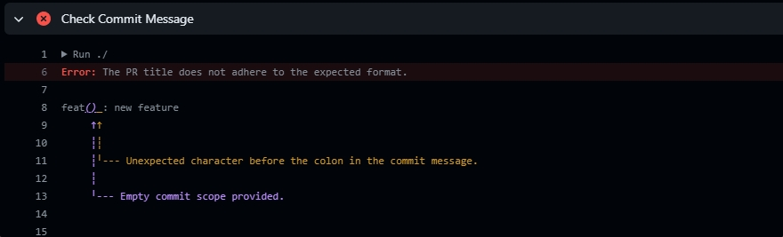
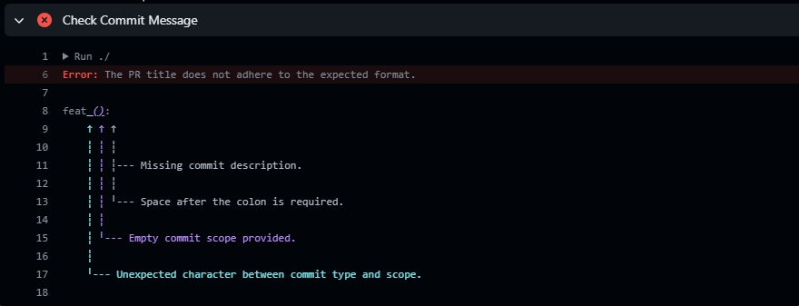
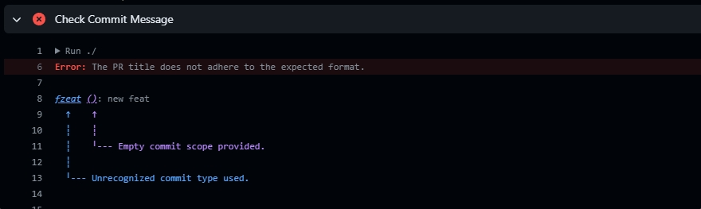
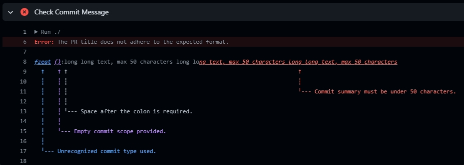

# Commit Harmonizer
[](https://github.com/aisevim/commit-harmonizer-action)
[](https://github.com/aisevim/commit-harmonizer-action/tags)


## Inputs

| Input            | Description                         | Required | Default |
| ---------------- | ----------------------------------- | -------- | ------- |
| `github-token`   | Token for repository access         | true     |         |
| `check-pr-title` | Enable PR title checking            | false    | true    |
| `check-commits`  | Enable last commit message checking | false    | true    |

## Usage

### On PR Title Edit and Last Commit Change

```yaml
name: Pull Request Message Checker

on:
  pull_request:
    types:
      - edited
      - opened
      - synchronize
      - reopened

jobs:
  check-commit:
    runs-on: ubuntu-latest
    steps:
      - name: Checkout Repository
        uses: actions/checkout@v4

      - name: Check Commit Message
        uses: aisevim/commit-harmonizer-action@v0.2.0
        with:
          github-token: ${{ secrets.GITHUB_TOKEN }}
```

### On PR Title Edit

```yaml
name: Pull Request Title Checker

on:
  pull_request:
    types:
      - edited


jobs:
  check-commit:
    runs-on: ubuntu-latest
    steps:
      - name: Checkout Repository
        uses: actions/checkout@v4

      - name: Check Commit Message
        uses: aisevim/commit-harmonizer-action@v0.2.0
        with:
          github-token: ${{ secrets.GITHUB_TOKEN }}
          check-commits: false
```

### On Last Commit Change

```yaml
name: Pull Request Commit Message Checker

on:
  pull_request:
    types:
      - opened
      - synchronize
      - reopened


jobs:
  check-commit:
    runs-on: ubuntu-latest
    steps:
      - name: Checkout Repository
        uses: actions/checkout@v4

      - name: Check Commit Message
        uses: aisevim/commit-harmonizer-action@v0.2.0
        with:
          github-token: ${{ secrets.GITHUB_TOKEN }}
          check-pr-title: false
```

## Outputs Examples

 

 

 

 

## License

This project is licensed under the [MIT License](LICENSE).


## Release Notes

See [CHANGELOG.md](CHANGELOG.md) for details on each release.